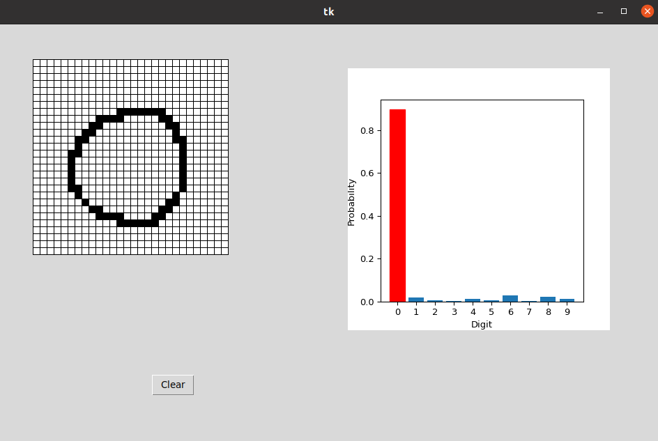

# TensorFlow Crash Course

This repository contains all files belonging to the TensorFlow Crash Course of the Deep Reinforcement Learning Course.
Overall, this crash course can be split up into the following three parts:

```
1. Model and Training
1.1 Dataset 
1.2 Model
1.3 Training loop 
1.4 Inference (Digit classifier window)
1.5 Build own layers
1.6 Plot a model

2. Tensor Operations
2.1 Motivation: No For loops
2.2 Tensors
2.3 Create
2.4 Element-wise operations
2.5 Aggregation
2.6 Matrix Multiplication
2.7 Tensor Modications
2.7.1 Add and remove dimensions
2.7.2 Concatenate
2.7.3 Stack
2.7.4 Stacking based on concatenation
2.7.5 Duplication
2.8 Tensor Broadcasting

3. Exercises
3.1 Colorize Tim's Garden
3.2 Pairwise Concatenation
3.3 Tensor Broadcasting
```

In part 1 the development of a digit classifier is presented. 
The user can draw digits in a box (left). 
Meanwhile the current prediction by the neural network based on this drawing is visualized (right).



## Requirements

- TensorFlow
- OpenCV
- matplotlib
- tkinter